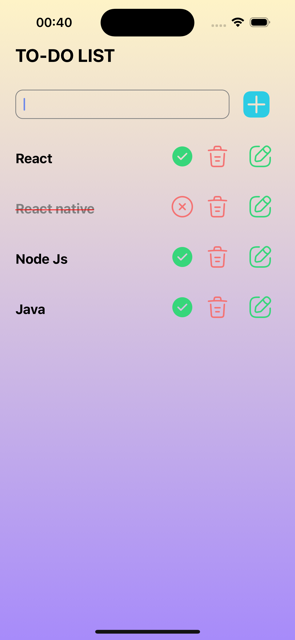
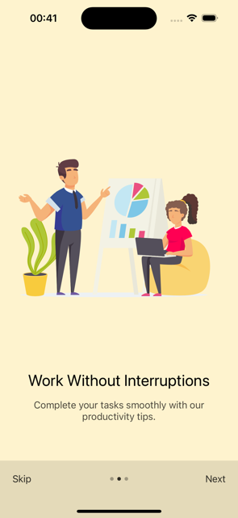

# Visually Rich Todo List Application

## 🎯 Project Overview

The Visually Rich Todo List Application is a modern mobile app built with React Native that allows users to effortlessly manage their daily tasks. Featuring Lottie animations for an engaging user experience, React Navigation for seamless screen transitions, and AsyncStorage for persistent data storage, this application offers both functionality and aesthetic appeal.

## Video gif


## Todo Screen



## other pages




## Features

- Add Tasks: Easily add new tasks to your todo list.
- Delete Tasks: Remove tasks you no longer need.
- Update Tasks: Edit existing tasks to reflect changes.
- Animations: Enhance user experience with Lottie animations.
- Data Persistence: Tasks are saved locally using AsyncStorage.
- Onboarding Screens: Guide new users through the app's features.
- Responsive Design: Optimized for various device sizes.
- Smooth Navigation: Seamless transitions between different screens using React Navigation.

### Technologies and Libraries Used

- React Native: Framework for building native apps using React.
- AsyncStorage: Local storage solution for persisting data.
- React Navigation: Library for managing in-app navigation.
- Lottie: Library for adding animations.
- React Native Onboarding Swiper: Component for creating onboarding screens.
- UUID: Library for generating unique identifiers.
- Iconsax React Native: Icon library for React Native.
- React Native Linear Gradient: Library for adding gradient backgrounds.
- React Native SVG: Library for rendering SVG images.

### clone the repository

```
git clone https://github.com/ozerbaykal/AsyncStorageLottie-react-native.git
```

### Navigate to the project directory:

```
cd AsyncStorageLottie-react-native
```

### Install the dependencies:

```
npm install
```

### Run the app on a simulator or device:

```
npm start

```

## Contributing

Contributions are welcome! Please open an issue first to discuss what you would like to change.

- 1.Fork the project
- 2.Create your feature branch (git checkout -b feature/NewFeature)
- 3.Commit your changes (git commit -m 'Add new feature')
- 4.Push to the branch (git push origin feature/NewFeature)
- 5.Open a Pull Request

<h2>Contact</h2>

Özer BAYKAL mail : baykalozer87@gmail.com

Project Link: https://github.com/ozerbaykal/AsyncStorageLottie-react-native
